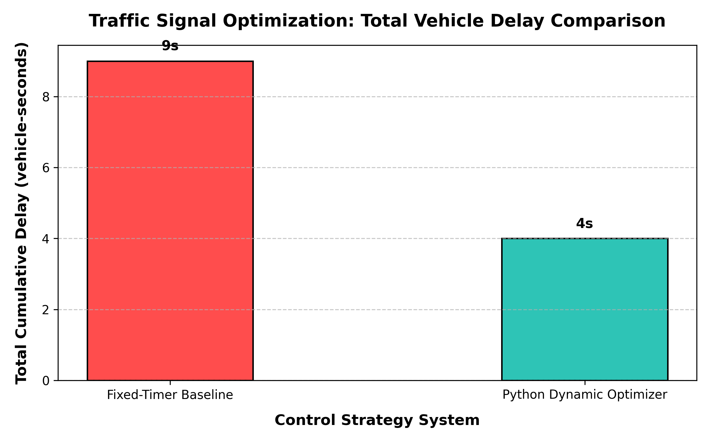

# AI-Powered Traffic Signal Optimizer 🚦

An intelligent traffic junction simulator designed to minimize vehicle congestion by bridging a high-performance C++ simulation engine with a dynamic Python optimization brain.

## 📊 Project Performance Results
By implementing dynamic queue-length tracking, the system achieves a significant reduction in cumulative vehicle wait times compared to traditional fixed-cycle traffic lights.

<!-- This tag links your newly generated chart image directly to the main page -->

## 🛠️ System Architecture & Workflow
* **C++ Core Engine (`main.cpp`):** Manages real-time vehicle spawning, strict bumper-to-bumper queueing arrays (`std::vector`), and outputs live data states.
* **Cross-Language Communication:** Utilizes file-based data structures (`state.txt` and `action.txt`) to bypass environment constraints and establish direct I/O message streams.
* **Python Optimizer (`optimizer.py`):** Acts as the smart controller, reading congestion metrics to dynamically override red signals when heavy gridlocks form.

## 📈 Key Engineering Takeaways
* Designed and debugged native time-loops and structural loops using low-level C++ classes.
* Implemented cross-language file handling (I/O) streams for reliable multi-process communication.
* Automated algorithmic metric graphing and performance validation using `matplotlib`.